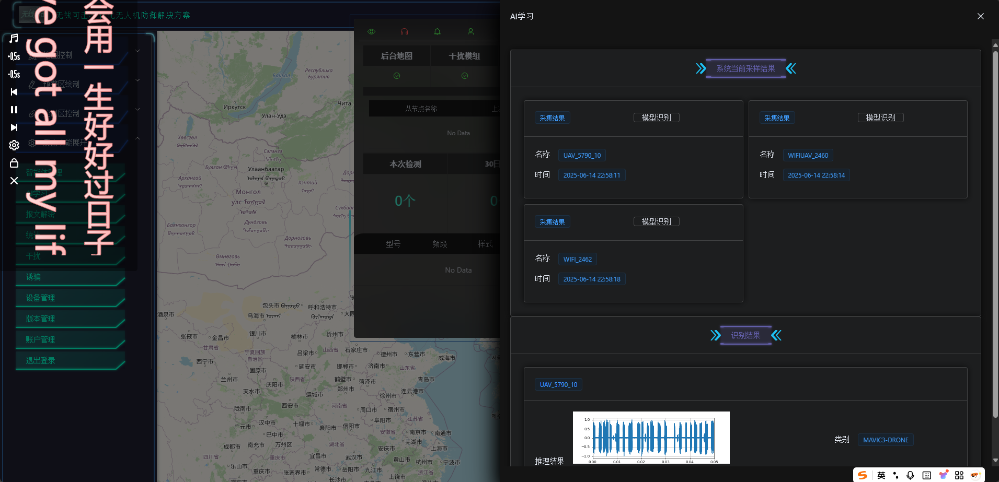
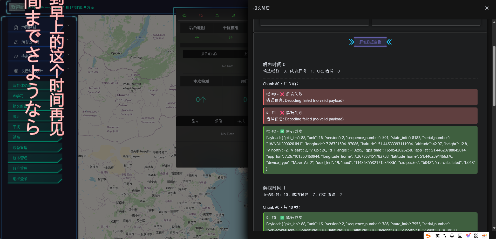

1. 总结归纳项目当前功能，做记录，进行功能的缺漏查补
    
    地图控制：放大缩小
    预警区绘制：矩形、圆形、擦除均无问题
    AI学习： 使用流程：点击 系统当前采样结果 后，在展示池中点击 模型识别 即可，无问题
    
    报文解密： 使用流程：点击 采样报文 后，在展示池中点击 解码报文 即可，无问题
    
    
    诱骗：此处需要在实际机器上再进行测试，脚本运行没有问题，
    干扰：此处需要在实际机器上再进行测试，脚本运行没有问题，
         
        使用流程：点击 获取干扰命令，点击 运行干扰 和 关闭 即可实现脚本开关的功能。
        后端替换方案：
            需要准备一个文件夹和一个yaml配置文件, 他们的名称需要和BaseConfig内的TARGET_SCRIPTS_PATH一致,否则无法正常读取配置和脚本
            文件夹内的每一个子文件夹，内部需要包括全部需要运行的脚本文件,子文件夹名称可以在yaml配置文件中配置。
            脚本需要的所有参数，也需要在yaml中对应的配置
            实际上这样配置确实不太方便，后续可以优化为动态获取配置的方案，可以的话最好在函数内添加一些返回值动态遍历即可
        
    设备管理：假的数据
    版本管理：基本上也是假的数据
    账户管理：暂时也没有具体的实现

2. 完善缺漏的部分功能
    控制区：设置控制区坐标：图像不显示 已解决
           目标预测：没有反应 已解决
           返回中心点：没有反应 whatever,直接跳过
    智能体助理：格式优化修复

    统计：测试样例可以正常绘制，不过大概需要稍微调一下：
        前端调整：DispFuncStaNew.vue文件内部需要调整，test需要删掉，24和58不需要动
        后端调整：spectrogram_service.py文件内部，utils下frequency内的new_24和new_58也需要调整，注释去除、逻辑调试

